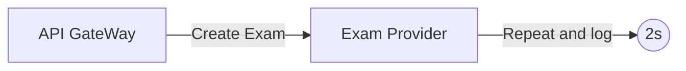
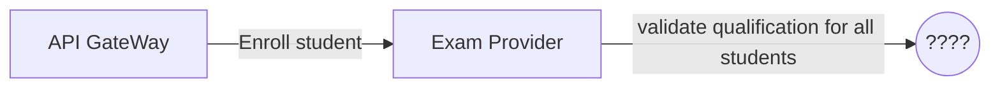

# Review of Exams System

## Exam Provider Container

### Avalability

```mermaid
flowchart LR
    api["API GateWay"]
    provider["Exam Provider"]
    downtime((2s))
    api--"Create Exam"-->provider
    provider--"Repeat and log"-->downtime
```

### Perfomance

```mermaid
flowchart LR
    api["API GateWay"]
    provider["Exam Provider"]
    downtime((????))

    api--"Enroll student"-->provider
    provider--"validate qualification for all students"-->downtime
```
